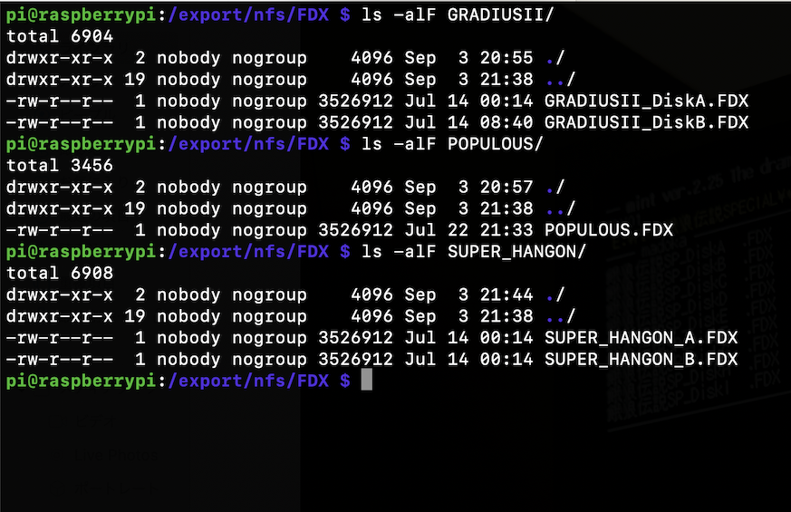
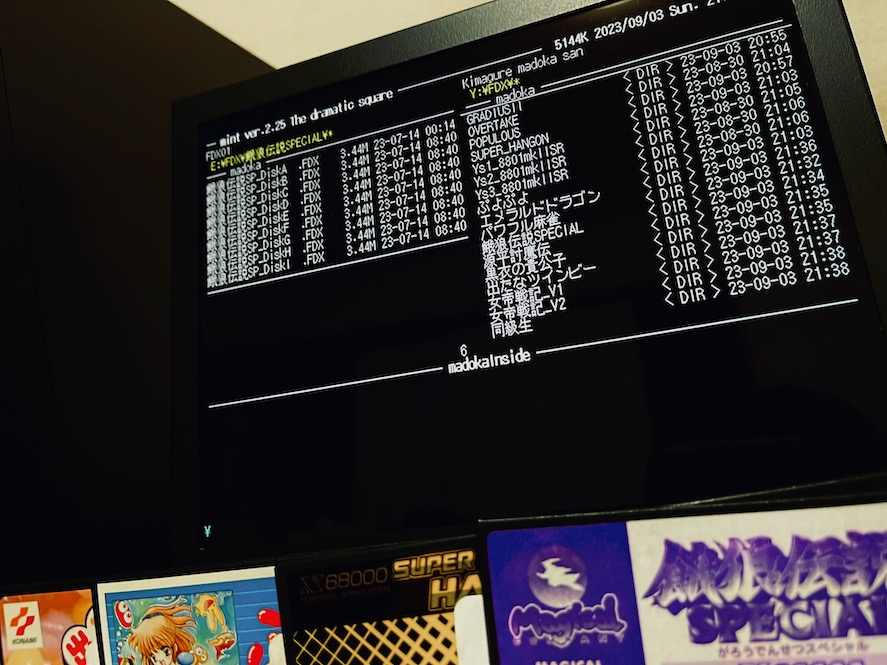

# Raspberry Pi で NFS Server を動かし X680x0実機 + Nereid + WiFi から NFSリモートドライブとして利用する覚書

## はじめに

この覚書は X680x0用 USB/LAN/Memory対応 同人ハードウェア Nereid の Ethernet 接続機能を利用して、Raspberry Pi 上のディスクを無線LAN越しにNFSでリモートドライブとしてマウントして利用するための覚書です。

この覚書は以下の実機にて確認した結果ですが、内容の正確性を何ら保証するものではありません。

* X68000XVI(16.7MHz) メモリ本体2MB + 内部増設6MB の合計8MB
* Nereid + midiori 複合ボード
* Buffalo 無線LANコンバータ WLI-UTX-AG300/C [https://www.amazon.co.jp/dp/B008MRUINC](https://www.amazon.co.jp/dp/B008MRUINC)
* Raspberry Pi 3A+ (FDX68シールド付)

---

## ハードウェアの準備

* X680x0実機
* Nereid (設計：X-PowerStation)
* WLI-UTX-AG300/C
* Raspberry Pi 3A+/3B+ または 4B
* 有線LANとブラウザを備えた環境

---

## 今回のIPネットワーク構成

|Host|Hostname|IP|Subnet Mask|
-|-|-|-
|X68000XVI Nereid|xvi|192.168.0.99|255.255.255.0|
|Raspberry Pi|raspi|192.168.0.100|255.255.255.0|

---

## WLI-UTX-AG300/C の設定

デフォルトで 1.1.1.1 固定IPとなっているので、有線Ethernetを備えたWindows PCなどでストレートケーブルで直結して設定を変更する。
その際にWindows側は固定IP 1.1.1.2 などにしておく。

管理画面でコンバータのIPは DHCPで自動取得 に変更しておく。

電源は外部USB電源、LAN端子はストレートケーブルでNereidに繋ぐ。

---

## ソフトウェアの準備と構成 (Raspberry Pi)

### 32bit Lite の最新版を入れる

### NFS server の導入

        sudo apt install nfs-kernel-server

### /etc/export

今回は `/export/nfs` をNFSで見せる。

        sudo mkdir -p /export/nfs
        sudo chmod -R 777 /export
        
### /etc/exports

サブネットは自分の環境に合わせた値を入れる

        /export/nfs    192.168.0.0/24(rw,fsid=0,nohide,insecure,no_subtree_check,async)

### /etc/default/nfs-kernel-server

以下の行を追加して NFSv2 を有効にする

        RPCNFSDOPTS="--nfs-version 2,3 --debug --syslog"

### NFS server 再起動

設定を反映させるため再起動

        sudo systemctl restart nfs-kernel-server

---

## ソフトウェアの準備 (X680x0)

以下を導入する。すべてかまださんのX68000 LIBRARYから入手できます。

* Human68k 3.02 及び関連ソフトウェア

[http://retropc.net/x68000/software/sharp/human302/](http://retropc.net/x68000/software/sharp/human302/)

* Nereid添付ディスク

[http://retropc.net/x68000/software/hardware/nereid/disk/](http://retropc.net/x68000/software/hardware/nereid/disk/)

* etherL12.sys

Nereid添付ディスク内のether_ne.sysと差し替えて使います。1.7倍高速とのことです。

[http://retropc.net/x68000/software/hardware/neptune_x/etherL12/](http://retropc.net/x68000/software/hardware/neptune_x/etherL12/)

* nfs.x 

NFSクライアント 0.38 

[http://retropc.net/x68000/software/internet/nfs/nfs/](http://retropc.net/x68000/software/internet/nfs/nfs/)

---

## ソフトウェアの構成 (X680x0)

### CONFIG.SYS

Nereidの推奨設定に従うが、ether_ne.sys の代わりに etherL12.sys を使う。

        FILES     = 50
        BUFFERS   = 99 4096
        LASTDRIVE = Z:
        PROCESS   = 16 10 50
        DEVICE    = \USR\SYS\etherL12.sys

### AUTOEXEC.BAT
        xip -n2
        ifconfig lp0 up
        ifconfig en0 192.168.0.99 netmask 255.255.255.0 up
        inetdconf +dns 192.168.0.1 +router 192.168.0.1

        SET HOST=xvi
        nfs 192.168.0.100:/export/nfs

### \usr\etc\hosts
        127.0.0.1       localhost   localhost
        192.168.0.99    xvi
        192.168.0.100   raspi

### \usr\etc\network
        127   loopback
        192.168.0  private-net

### \usr\etc\protocols
        ip    0     IP
        icmp  1     ICMP
        tcp   6     TCP
        udp   17    UDP

### \usr\etc\services
        ftp-data  20/tcp
        ftp       21/tcp
        telnet    23/tcp
        domain    53/tcp    nameserver
        domain    53/udp    nameserver
        finger    79/tcp    finger

---

## 動作確認

### Raspberry Pi -> X680x0 ping

        ping 192.168.0.99

### Raspberry Pi ftp loopback

        ftp 192.168.0.100

### X680x0 -> Raspberry Pi ping

        ping 192.168.0.100

### X680x0 -> Raspberry Pi nfs

        dir y:

mintから Raspberry Pi NFSドライブを操作している様子。デフォルトだとNFSドライブはY:になります。

